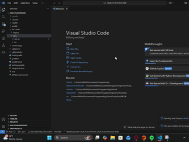
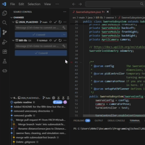

# Installing the library 
`git submodule add https://github.com/FRC9149/Bill-Lib.git src/main/java/Bill-lib -b main`\
Installs the the library in the src/main/java/Bill-lib directory on the main branch.\

# Cloning a repo with this library
If you clone a repo that uses this library, use this command to get the latest version and set up source control in VS Code.\
`git submodule update --remote --init` \
After using this command, you will then have to change the branch to main.\

# Updating the library
After setting up the library, you will see 2 commit boxes in Source Control. One will have the name of the original project and the other will be named Bill-lib. We are essentially just importing the Bill library straight into the original project. It's important that you know how to push changes properly so that your pushes actually make it through and you don't push to the wrong branch/section of code.
- First, you need to make sure you are pushing to a branch not a commit. ex: main not 48858ec 
- Then commit and sync as normal.
- You will see that the orginal project also has a Bill-lib change that you will need to push.
  - If you don't push on the original project, then the library will be out of sync on github and when pulling.

